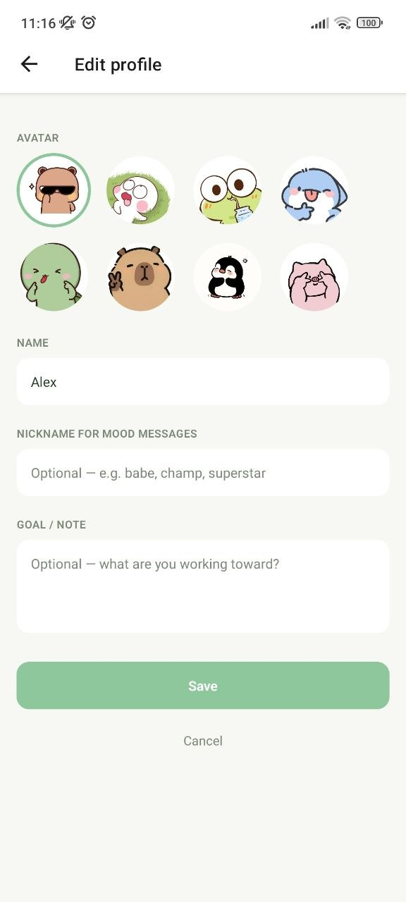

# 🌿 Hazy Days Tracker

A lighthearted habit tracker for logging clean, weed, alcohol, or "both" days on a calendar — with streaks, monthly stats, and a mood card that reacts to how your month's actually going.

Built with [Expo](https://expo.dev) (SDK 55) and [Expo Router](https://docs.expo.dev/router/introduction).

## Features

- **Calendar logging** — tap any day to mark it clean, weed, alcohol, or both. Color-coded legend and a monthly "verdict" (mostly clean / mixed / heavier month) based on your ratio for that month.
- **Profile stats** — clean days, current streak, best streak, and total days tracked, all computed live from your logged entries.
- **This month's mood** — a card that shifts tone (proud → gentle warning → disappointed → dramatic) based on this month's clean ratio, with a "waiting for data" state until at least 3 days are logged.
- **Settings** — reminder toggle with a custom time picker, week start day (Sun/Mon), accent color picker, and data export/clear.
- **Local persistence** — entries are saved on-device with `AsyncStorage`, so your history survives app restarts.

## Tech stack

- [Expo](https://expo.dev) + [Expo Router](https://docs.expo.dev/router/introduction) (file-based routing)
- React Native, TypeScript
- [react-native-calendars](https://github.com/wix/react-native-calendars) for the calendar view
- React Context for shared state (`SettingsContext`, `EntriesContext`)
- `@react-native-async-storage/async-storage` for local persistence
- Google Fonts (Poppins) via `@expo-google-fonts/poppins`

### Screenshots

| Calendar | Settings | Profile — proud |
|---|---|---|
|  |  |  |

| Profile — gentle warning | Profile — disappointed | Profile — dramatic |
|---|---|---|
|  |  |  |

| Profile — no entries yet | Reminder time picker |
|---|---|---|
|  |  |   |

## Getting started

1. **Install dependencies**

   ```bash
   npm install
   ```

2. **Start the app**

   ```bash
   npx expo start
   ```

   From the output you can open the app in a [development build](https://docs.expo.dev/develop/development-builds/introduction/), an Android emulator, an iOS simulator, or [Expo Go](https://expo.dev/go).

> **Note:** This project tracks Expo SDK 55, which changed significantly from earlier SDKs. If you're extending this app, check the [versioned docs](https://docs.expo.dev/versions/v55.0.0/) before assuming an older API still applies.

## Project structure

```
src/
  app/
    _layout.tsx          # Root layout — wraps app in providers, loads fonts
    (tabs)/
      index.tsx           # Calendar tab
      profile.tsx          # Profile tab (stats + mood card)
      settings.tsx          # Settings tab
  context/
    SettingsContext.tsx    # Reminder, week start, accent color
    EntriesContext.tsx      # Logged days, streaks, monthly stats, persistence
assets/
  images/
    emoticons/              # Mood card artwork
docs/                        # Additional project documentation
```

## Documentation

Additional docs live in [`docs/`](./docs).

## Data & privacy

All data is stored locally on-device via `AsyncStorage` — nothing is sent to a server. Clearing app data or uninstalling the app removes it permanently, and there is currently no export-to-file or backup mechanism (the Settings screen's "Export" is a placeholder).

## Roadmap / known gaps

- Accent color picker in Settings doesn't yet theme the app.
- Reminder toggle doesn't yet schedule real notifications.
- No real data export (CSV/JSON) yet — only local `AsyncStorage`.
- Entries are stored as a single JSON blob; fine at current scale, but would need restructuring for very large histories.

## Future enhancements

- 🌙 **Dark mode** — a proper dark theme, ideally following system appearance settings. (The Settings screen already has a disabled "Coming soon" toggle for this.)
- 🎨 **Live accent theming** — make the Settings accent color picker actually restyle the app instead of sitting unused.
- 🔔 **Real notifications** — wire the reminder toggle up to scheduled local notifications instead of just a UI switch.
- ✏️ **Edit profile** — let users change their name/avatar (currently static "Alex" placeholder on the Profile screen).
- 📤 **Data export** — real CSV/JSON export from the Settings screen, not just a placeholder alert.
- ☁️ **Backup/sync** — optional cloud backup so entries survive an uninstall or device switch.
