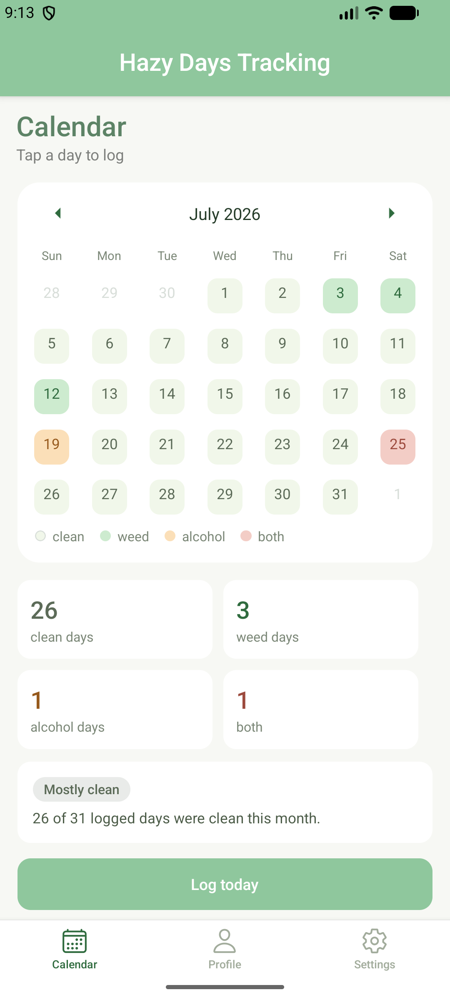
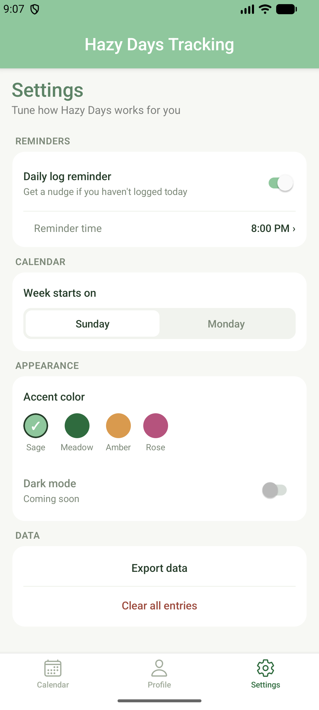

# 🌿 Hazy Days Tracker

A lighthearted habit tracker for logging clean, weed, alcohol, or "both" days on a calendar — with streaks, monthly stats, and a mood card that reacts to how your month's actually going.

Built with [Expo](https://expo.dev) (SDK 55) and [Expo Router](https://docs.expo.dev/router/introduction).

Repo: https://github.com/ShehaniKavindi/Hazy-Days-Tracker

## Demo

https://github.com/user-attachments/assets/48b29d9f-3ce4-4bc1-8406-4cac34d90089


## Features
 
**Onboarding**
- 3-step welcome flow (welcome → name → ready) on first launch
**Calendar**
- Tap any day to log it clean, weed, alcohol, or both
- Color-coded legend, today highlighted separately from logged days
- Monthly verdict (mostly clean / mixed / heavier) based on your ratio
- "Both" days count toward the weed *and* alcohol totals, not just their own
- Reset button in the log modal to clear an accidental or future-dated entry
**Profile**
- Clean days, current streak, best streak, and days tracked — computed live
- Editable name, avatar, nickname, and a personal goal/note
- Blank name shows a warning and falls back to "Idiot," not a silent failure
- Mood card whose tone shifts with your clean ratio, addressing you by name/nickname mid-message
**Reminders**
- Daily log reminder with a custom time picker, backed by real scheduled notifications
- Requires a development build on Android — see [Notifications](#notifications)
**Data**
- Export all entries to a `.json` backup via the native share sheet
- Import a backup back in — matching dates are overwritten, the rest is untouched
- Everything persists on-device via `AsyncStorage`, surviving app restarts
**Settings & branding**
- Week start day (Sun/Mon) and a working accent color picker that themes the whole app
- Custom app icon, adaptive Android icon, and splash screen


## Tech stack

- [Expo](https://expo.dev) + [Expo Router](https://docs.expo.dev/router/introduction) (file-based routing)
- React Native, TypeScript
- [react-native-calendars](https://github.com/wix/react-native-calendars) for the calendar view
- React Context for shared state (`SettingsContext`, `EntriesContext`, `ProfileContext`)
- `@react-native-async-storage/async-storage` for local persistence
- `expo-notifications` for scheduled daily reminders (guarded against Expo Go on Android, where it isn't supported)
- `expo-file-system`, `expo-sharing`, and `expo-document-picker` for data export/import
- Google Fonts (Poppins) via `@expo-google-fonts/poppins`

### Screenshots

| Calendar | Settings | Profile — gentle warning | Reminder time picker |
|---|---|---|---|
|  |  |  |  |

| Profile — proud | Profile — disappointed | Profile — dramatic | Profile — no entries yet |
|---|---|---|---|
|  |  |  |  | 

> An Edit Profile screenshot isn't included yet — drop one into `docs/screenshots/` and add a row for it whenever you have it.

See [Demo](#demo) above for a full screen recording of the app in action.

## Getting started

1. **Install dependencies**

   ```bash
   npm install
   ```

2. **Start the app**

   ```bash
   npx expo start
   ```

   From the output you can open the app in a [development build](https://docs.expo.dev/develop/development-builds/introduction/), an Android emulator, an iOS simulator, or [Expo Go](https://expo.dev/go).

> **Note:** This project tracks Expo SDK 55, which changed significantly from earlier SDKs. If you're extending this app, check the [versioned docs](https://docs.expo.dev/versions/v55.0.0/) before assuming an older API still applies — this includes `expo-file-system`, which moved to a new `File`/`Directory` class-based API in this SDK; the legacy string-path functions (`writeAsStringAsync`, etc.) are deprecated.

## Notifications

Local scheduled reminders use `expo-notifications`. Two important platform notes:

- **Expo Go on Android can't do this at all** since SDK 53 — push notification support was removed from Expo Go on Android, and that removal also breaks local notification scheduling there. The app detects this at runtime (via `expo-constants`'s `ExecutionEnvironment`) and toggling the reminder on inside Expo Go on Android will silently no-op with a console warning instead of crashing.
- **To actually test reminders**, run a real development build instead of Expo Go:

  ```bash
  npx expo run:android
  ```

  This compiles and installs your own native build (with its own icon, separate from the Expo Go app) onto a simulator, emulator, or physical device, and real notification scheduling works there. EAS Build (`npx eas build --profile development --platform android`) is the equivalent cloud-based option if you'd rather not build locally.

## Data & privacy

All data is stored locally on-device via `AsyncStorage` — nothing is sent to a server. From Settings, you can export everything to a `.json` file (via the OS share sheet) as a manual backup, and import a previously exported file back in later. Clearing app data, uninstalling the app, or simply never exporting means the data is gone for good — there's currently no automatic cloud backup.

## Project structure

```
src/
  app/
    _layout.tsx           # Root layout — wraps app in providers, loads fonts
    index.tsx              # Start gate — redirects to onboarding or (tabs) based on saved status
    onboarding.tsx          # 3-step first-launch welcome flow
    edit-profile.tsx         # Modal screen for editing name/avatar/nickname/goal note
    (tabs)/
      index.tsx              # Calendar tab
      profile.tsx              # Profile tab (stats + mood card)
      settings.tsx              # Settings tab (theming, reminders, data export/import)
  context/
    SettingsContext.tsx    # Reminder scheduling, week start, accent color/theming
    EntriesContext.tsx      # Logged days, streaks, monthly stats, persistence
    ProfileContext.tsx       # Name, avatar, nickname, goal note, persistence
assets/
  images/
    emoticons/              # Mood card artwork
    pfp/                     # Preset avatar choices for Edit Profile
    welcome/                  # Onboarding illustrations
docs/
  screenshots/              # Screenshots and demo video used in this README
```

## Documentation

Additional docs live in [`docs/`](./docs).

## Roadmap / known gaps

- Entries are stored as a single JSON blob; fine at current scale, but would need restructuring for very large histories.
- Onboarding only collects a name — avatar/nickname/goal note are still set later via Edit Profile, not during the initial flow.
- Export/import round-trips the raw `entries` object as JSON; there's no CSV option yet for opening a backup in a spreadsheet.

## Future enhancements

- 🌙 **Dark mode** — a proper dark theme, ideally following system appearance settings. (The Settings screen already has a disabled "Coming soon" toggle for this.)
- ☁️ **Cloud sync** — optional Google sign-in + Firebase/Supabase backend so entries survive an uninstall or sync across devices, staying local-only by default for anyone who doesn't sign in.

## Author
Shehani Kavindi
Software Engineer Undergraduate at Birmingham City University
